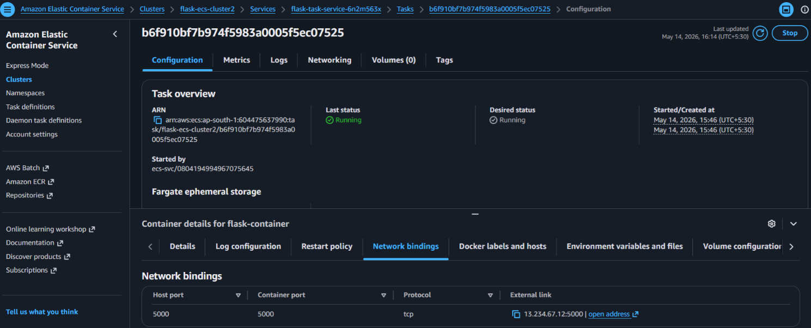
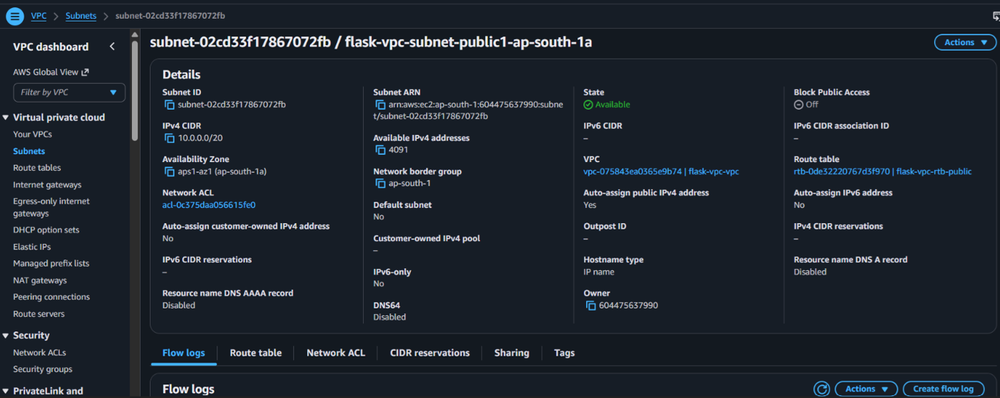
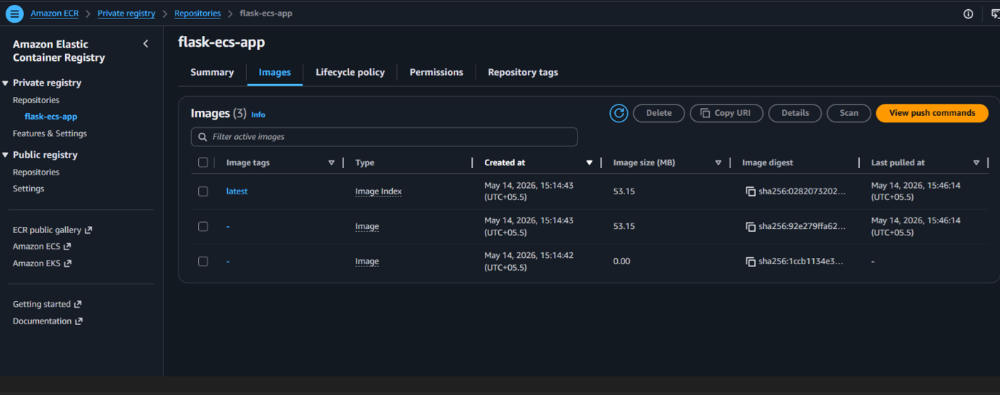

# Containerized-Flask-Application
Built and deployed a Docker-based Flask application using Amazon ECR and ECS for containerized application management.

🎯 **Purpose**
Deploy and run a Python Flask application using Docker containers for easy deployment, scalability, and container management.

🧰 **AWS Services**
* Amazon Elastic Container Registry (Amazon ECR)
* Amazon Elastic Container Service (Amazon ECS)

⚙️ **Workflow**
1. Create Flask application
2. Create `requirements.txt`
3. Create Dockerfile
4. Build Docker image
5. Push image to Amazon ECR
6. Create ECS Cluster
7. Create Task Definition
8. Deploy ECS Service
9. Access application through browser

📌 **Outcome**
Successfully containerized and deployed a Flask application on AWS using Docker, ECR, and ECS for efficient application management and scalability.

## 📸 Project Screenshots

### 1. Amazon ECS Cluster
This shows the ECS cluster running the Flask container.

### 2. Docker Configuration
This shows the Dockerfile used for containerization.

[View Dockerfile](Dockerfile)

### 3. Flask Application Output
This shows the Flask application running in the browser.

### 4. ECS Task Definition
This shows the ECS task definition configuration.

### 5. VPC and Subnet Configuration
This shows the networking setup for ECS deployment.

### 6. Amazon ECR Repository
This shows the Docker image repository stored in Amazon ECR.

## 📂 Project Files

### Flask Application
[View app.py](app.py)

### Python Requirements
[View requirements.txt](requirements.txt)

### Docker Configuration
[View Dockerfile](Dockerfile)
